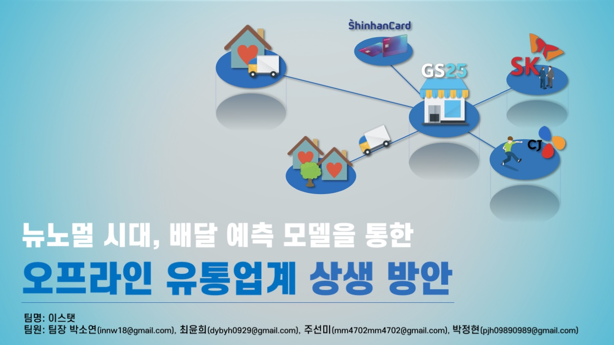

# 2020 빅콘테스트 혁신아이디어분야 대상

### ['이스탯'팀 최종 발표 영상 클릭][presentation-link]  

자세한 발표 내용이 궁금하시다면 링크를 클릭해주세요!

### 공모 주제

**뉴노멀 시대 준비를 위한 서비스 아이디어 및 PoC(Proof Of Concept) 결과 제시**

제공 데이터 | 외부 데이터
----- | ----- 
**유동인구데이터(SKT)** | 배달업종별이용통화량(SKT Big Data Hub) 
**카드매출데이터(신한카드)** | 인구통계(서울열린데이터광장)
**유통데이터(GS리테일)** | 소비자동향지수(e-나라지표)
**물류데이터(CJ올리브네트웍스)** | 지상관측자료(기상청 날씨누리)
**SNS데이터(와이즈넛)** | 서울대기환경정보(cleanair)

#### [1. 프로젝트 소개][1-link]

#### [2. 소비/경제/행동 변화에 따른 사회적 영향 분석][2-link]

#### [3. 영향력이 가장 큰 문제 도출][3-link]

#### [4. 예측 모델링 구축][4-link]

#### [5. 서비스 아이디 및 Proof of Concept 결과 제시]

EDA와 POC 결과는 보안상의 이유로 결과를 첨부하지 않았습니다. 자세한 내용은 발표 링크를 확인해주세요.

### Collaborator

* 박소연
* 박정현(@JngHyun)
* 주선미(@givitallugot)
* 최윤희

[presentation-link]: https://youtu.be/32Y5Vtngc-Y?t=5131
[1-link]: https://github.com/givitallugot/2020-BIGCONTEST-ESTAT/tree/main/1.%20%ED%94%84%EB%A1%9C%EC%A0%9D%ED%8A%B8%20%EC%86%8C%EA%B0%9C
